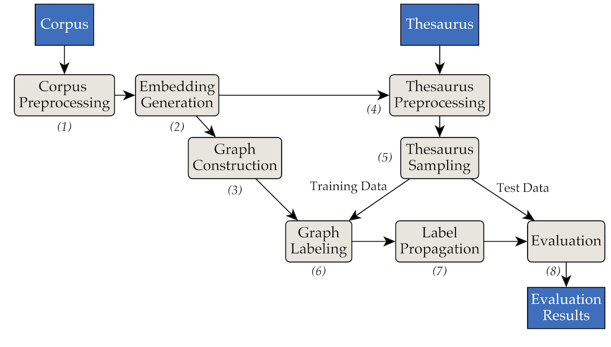

# Thesaurus Extension using Label Propagation
A tool for Thesaurus Extension using Label Propagation methods. From a text corpus and an existing thesaurus, it generates suggestions for extending the existing synonym sets.
This tool was developed during the Master's Thesis "[_Label Propagation for Tax Law Thesaurus Extension_](https://wwwmatthes.in.tum.de/pages/1k57iql63u5m5/Master-s-Thesis-von-Markus-Mueller)" at the Chair "Software Engineering for Business Information Systems (sebis)", Technical University of Munich (TUM).

> **Thesis Abstract.** With the rise of digitalization, information retrieval has to cope with increasing amounts of digitized content. Legal content providers invest a lot of money for building domain- specific ontologies such as thesauri to retrieve a significantly increased number of relevant documents. Since 2002, many label propagation methods have been developed e.g. to identify groups of similar nodes in graphs. Label propagation is a family of graph-based semi-supervised machine learning algorithms. In this thesis, we will test the suitability of label propagation methods to extend a thesaurus from the tax law domain. The graph on which label propagation operates is a similarity graph constructed from word embeddings. We cover the process from end to end and conduct several parameter-studies to understand the impact of certain hyper-parameters on the overall performance. The results are then evaluated in manual studies and compared with a baseline approach.

The tool was implemented using the following pipes and filters architecture:

## Pre-Requisites
1. Install `pipenv` ([Installation Guide](https://pipenv.readthedocs.io/en/latest/install/#installing-pipenv)).
2. Install the project's requirements with `pipenv install`.

## How to run
- **Input**: This tools expects a set of text corpus files in `data/RW40jsons`, and the thesaurus in `data/german_relat_pretty-20180605.json`. See [phase1.py](src/lib/phase1.py) and [phase4.py](src/lib/phase4.py) for information about the expected file formats.
- **Start**: See [sample_commands.md](src/docs/sample_commands.md) for examples on how to run the pipeline with a set of hyper-parameters. The default hyper-parameter set is given in [base_config.py](base_config.py). The hyper-parameters can be overwritten when running a start script.
- **Output**: In a run, output of each individual phase is stored in `output/<PHASE_FOLDER>/<DATE>`. Most important are `08_propagation_evaluation` and `XX_runs`. In `08_propagation_evaluation`, the evaluation statistics are stored as `stats.json` together with a table that contains predictions, training and test set (`main.txt`, in the other scripts most often refered to as `df_evaluation`). In `XX_runs`, a run's log is stored. If multiple runs were triggered via [multi_runs.py](src/multi_runs.py) (each with a different training/test set), the combined statistics of all individual runs are stored as `all_stats.json` as well.

## Synset Vector Baseline
Via [purew2v_parameter_studies.py](src/baselines/purew2v_parameter_studies.py), the synset vector baseline that we introduced in our thesis can be executed. It requires a set of word embeddings and one or multiple thesaurus training/test splits. See [sample_commands.md](src/docs/sample_commands.md) for an example.

## Jupyter Notebooks
In `ipynbs`, we provided some exemplary Jupyter notebooks that were used to generate (a) statistics, (b) diagrams and (c) the Excel files for the manual evaluations. You can explore them by running `pipenv shell` and then starting Jupyter with `jupyter notebook`.

## Further notes
- For GloVe embeddings to work, [GloVe](https://github.com/stanfordnlp/GloVe) needs to be installed and built manually. Then, the build path needs to be either specified in [base_config.py](base_config.py) or specified as a parameter when calling `main.py` or `multi_run.py`.
- This tool was developed for use on Ubuntu 18.04.1 LTS (Bionic Beaver) and macOS 10.14 (Mojave)
- In case you have any questions, feel free contact the authors or open an issue!
